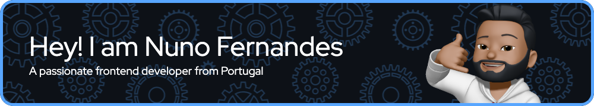

 

## About me
- 🔭 I’m currently workin at InflightIT
- ⚡ Fun fact: I'm a motorcycle enthusiast.
- 📖 [Curriculum](https://pdfhost.io/v/NGqiKIouw_Europass.pdf)

## My stats

## Languages and Tools:

            

## Connect with me:

